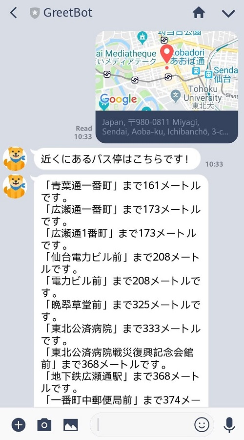

# 仙台おでかけアシスタント LINE Bot

- テキストでメッセージを投げると、仙台の現在の天気情報と３時間毎の予報をダイジェストで教えてくれます。
- 現在地の GPS 情報を伝えると、そこから近い地下鉄駅の名前と直線距離、および直近の発車時刻を教えてくれます。
- 現在地の GPS 情報を伝えると、そこから近いバス停の名前と直線距離を教えてくれます。

## ToC

- [仙台おでかけアシスタント LINE Bot](#%e4%bb%99%e5%8f%b0%e3%81%8a%e3%81%a7%e3%81%8b%e3%81%91%e3%82%a2%e3%82%b7%e3%82%b9%e3%82%bf%e3%83%b3%e3%83%88-line-bot)
  - [ToC](#toc)
  - [Description](#description)
  - [Files](#files)
  - [Requirements](#requirements)
  - [Usage: Install dependencies](#usage-install-dependencies)
  - [Usage: Parse Original Data (Optional)](#usage-parse-original-data-optional)
    - [Save subway timetables to SQLite](#save-subway-timetables-to-sqlite)
    - [Save positions of subway stations & bus stops to SQLite](#save-positions-of-subway-stations--bus-stops-to-sqlite)
  - [Usage: Deploy the bot to Heroku](#usage-deploy-the-bot-to-heroku)
    - [About reply token of  LINE Messaging API](#about-reply-token-of-line-messaging-api)
    - [Get API Keys](#get-api-keys)
    - [Run the app locally to debug it](#run-the-app-locally-to-debug-it)
    - [Trouble Shooting: `Address already in use` on `flask run`](#trouble-shooting-address-already-in-use-on-flask-run)
    - [Deploy to Heroku](#deploy-to-heroku)
  - [Todo](#todo)

## Description

- バス停と地下鉄駅の GPS 座標情報は、「国土交通省国土数値情報」に拠ります。
- 地下鉄時刻表は、仙台市交通局のウェブサイトから取得しました。
- 現在の天気情報は OpenWeather API から取得します。
- LINE Bot SDK: https://github.com/line/line-bot-sdk-python/blob/master/examples/flask-kitchensink/app.py

## Files

- `app.py`
  - Run Flask, handle requests / responses of LINE API
- `tools.py`
  - Access to SQLite DB / OpenWeather API to cook necessary data for the `app.py`
- `get_busstop_pos.py`
  - Process downloaded XML file of bus stop positions, then save them to SQLite DB
- `get_station_pos.py`
  - Process downloaded JSON file of subway station positions, then save them to SQLite DB
- `get_subway_timetable.py`
  - Webscrape the website of Sendai trans bureau, then save subway schedule to SQLite DB
- `constants.py`
  - Set file paths
- `positions.db`
  - `stations` table: latitude & longitude of all the subway station
  - `stops` table: latitude & longitude of all the bus stops in Miyagi pref
  - `timebatle_subway_weekday` table: Subway schedule, as of May 1st 2020
  - `timebatle_subway_holiday` table: Subway schedule, as of May 1st 2020

## Requirements

- Python 3
- Pipenv

## Usage: Install dependencies

1. `pipenv shell`
2. `pipenv install`

## Usage: Parse Original Data (Optional)

- This is optional; the outcome DB is already included in this repo
- Create SQLite DB `positions.db` at root directory first

### Save subway timetables to SQLite

1. `python3 get_subway_timetable.py`

### Save positions of subway stations & bus stops to SQLite

1. Download the source data:
   - [国土数値情報　バス停留所データ](http://nlftp.mlit.go.jp/ksj/gml/datalist/KsjTmplt-P11.html)
   - [国土数値情報　鉄道データ](http://nlftp.mlit.go.jp/ksj/gml/datalist/KsjTmplt-N02-v2_3.html)
2. Locate the files in `constants.py`
3. `python3 get_busstop_pos.py`
4. `python3 get_station_pos.py`

## Usage: Deploy the bot to Heroku

### About reply token of  LINE Messaging API

- Reply token is required to reply
- Reply token changed every time you get the message
- Reply token can be used only once
- Reply token expires soon; reply as quickly as possible

### Get API Keys

- Create LINE developer account & bot
- Note down `LINE Channel Secret`, export it as env var on your PC
- Note down `LINE Channel Access Token`, export it as env var on your PC
- On LINE app, add the bot to your friend list
- Create OpenWeather account
- Note down OpenWeather API key

### Run the app locally to debug it

1. `sudo snap install ngrok`
2. `ngrok http 5000`
   - 5000 is the flask port num
3. Write down the HTTPS address shown on the terminal
   - `https://abc123xy.ngrok.io/`
4. Set the webhook URL on LINE developer website
   - `https://abc123xy.ngrok.io/callback`
   - Don't forget to add `callback`, or Ngrok will return `405: Not Allowed`
   - Because routing is `@app.route("./callback")` in my `app.py`
5. `export FLASK_APP=app.py`
6. `export FLASK_DEBUG=1`
7. `flask run` (~~`python3 app.py`~~ is deprecated)

### Trouble Shooting: `Address already in use` on `flask run`

1. `netstat -tulpn | grep LISTEN` to find the Flask run process
2. `kill -9` that process

### Deploy to Heroku

1. `sudo snap install --classic heroku` : Install Heroku CLI on Ubuntu
1. `heroku login` for the 1st time to use CLI; you'll be prompted to login on the browser
1. Setup project
   - `heroku create my_heroku_app` if you create the project
   - ~~`heroku git:clone -a my_heroku_app` if you need to clone from Heroku~~ (According to Heroku doc, this is NOT RECOMMENDED)
   - `git remote add heroku https://git.heroku.com/my_heroku_app.git` if you push the existing project
1. ~~`pip freeze >> requirements.txt`~~ (Not necessary? Seemingly Heroku can detect Pipfile)
1. `echo web: gunicorn app:app --log-file - >> Procfile`
   - The 1st `app` is for `app.py`
   - The 2nd `app` is for `app = Flask(__name__)`
   - Others are options for gunicorn
   - gunicorn is a HTTP WSGI server for Python
   - WSGI (Web Server Gateway Interface) is an interface for Python
   - WSGI links Web Server & Web app
   - Flask dev server can't be used for production, so you need gunicorn
1. `echo python-3.7.6 >> runtime.txt`
   - Note that some Python versions aren't available on Heroku
1. Build on Heroku
   - `git push heroku master`
   - Or connect to your GitHub page
1. Turn on / off the web app
   - `heroku ps:scale web=1 -a appnamehere` or start on Heroku website
   - `heroku ps:scale web=0 -a appnamehere` or stop on Heroku website
1. `heroku config:set LINE_CHANNEL_SECRET=foo`
1. `heroku config:set LINE_CHANNEL_ACCESS_TOKEN=bar`
1. `heroku config:set OPEN_WEATHER_API_KEY=bruh`
1. Add `.slugignore` and specify files which aren't necessary for the bot app
1. `heroku open -a appnamehere`
   - Check if it shows "hello world"
1. `heroku logs --tail -a appnamehere`
   - Show realtime log

## Todo

- 今は直線距離を返すだけだが、現在地から直近バス停まで Google Map アプリでルート表示するようにする？
- 自然言語処理系の学習済みモデルなどを使って、もうちょっと高度な会話をできないか？
  - Hachidori とか、Dialogflow とか、そのへん
- バス時刻検索機能をつけられないか？
  - 時刻やルートも表示しないと、バス停検索機能の有用性は低い...
  - 宮城交通や仙台市交通局は時刻表データの一括ダウンロードデータを公開していない
  - さらにいうと、バス停の情報が古い。H22 分が公開されている中では最新。新設・廃止バス停がちらほらあるようなので
  - 仙台市交通局のバス検索にクエリ（出発地&目的地バス停、時刻）を投げて、検索結果のウェブページを Scraping するのは量が膨大すぎて実質的に無理
- Google Calendar APIと「日本の祝日」カレンダーを使って当日が祝日かどうか判定する？
  - Google Calendarは仕様がよく変わるといっている記事もあり、そこまで対応しきれない
  - ただ、そこまで必要ないような。平日分と祝日分両方を提示して、使う側が判断すればいいだけ
